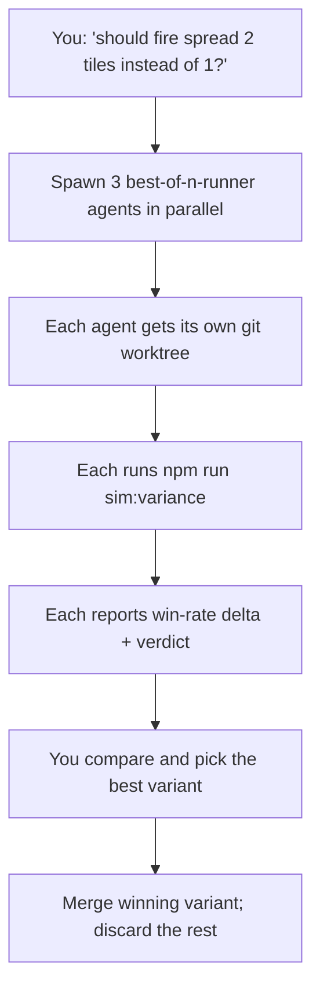

# Drift Sim Workflow

The Drift sim lab is a headless, deterministic simulator for the Drift battle engine. It exists to answer one question: **does the design create real strategy variance, or is it dominated by a single approach?**

This doc covers:
1. The CLI you can use today.
2. The parallel-agent recipe for running design experiments in isolated git worktrees.

## CLI quickstart

The lab lives in `src/sim/`. The engine itself is unchanged at runtime — sim plays the same game functions the React UI calls, just with a seeded RNG.

```bash
# Quick sanity: 10 games with one strategy
npm run sim:smoke -- --strategy=GreedyDamage --games=10

# Full matrix (5 strategies × 3 enemy comps × 200 seeds = 3000 games)
npm run sim:tournament

# Tournament + variance analysis + write a markdown report
npm run sim:variance
```

The `variance` script writes a timestamped markdown file to `sim-results/`. Each report includes the full win-rate matrix, coverage scores, and a verdict (`good`, `flat`, `dominant`, `lopsided`).

### CLI flags

| Flag | Default | Notes |
| --- | --- | --- |
| `--seeds=<n>` | 200 | Seeds per (strategy, enemy comp). |
| `--base-seed=<n>` | 12345 | Base seed for reproducibility. |
| `--turn-cap=<n>` | 30 | Hard turn cap to bound runtime. |
| `--strategy=<name>` | GreedyDamage | Used by `smoke` only. |
| `--report` | off | Write markdown report (used by `variance`). |
| `--out-dir=<path>` | `sim-results/` | Report destination. |
| `--quiet` | off | Suppress progress dots. |

### What the verdicts mean

- **good** — Multiple strategies are viable in at least one condition; strategies meaningfully shift across conditions. Wind / enemy comp matters. Ship it.
- **flat** — Strategies have nearly identical win rates everywhere. The board state isn't affecting decisions enough; the game lacks variance.
- **dominant** — One strategy wins ≥70% across all conditions. The design is broken — that strategy is OP. Tune it down.
- **lopsided** — One strategy loses ≥70% across all conditions. The design is broken — that strategy is starved. Buff its tools.

## Phase 2: parallel-agent design experiments

Once you have a baseline variance report, the cheapest way to evaluate design changes is to spawn N agents in parallel — each running in its own git worktree — that implement competing variants and report sim deltas back to you.



The `best-of-n-runner` subagent type already creates an isolated git worktree, so multiple agents can edit the same files without merge conflicts. Because every agent runs the **same** sim suite, results are directly comparable.

### Recipe: run an A/B/C design experiment

1. Pick a hypothesis with multiple credible alternatives.
2. Get a baseline first if you don't have one for the current branch:
   ```bash
   npm run sim:variance
   git add sim-results/<latest>.md && git commit -m "sim: baseline before <hypothesis>"
   ```
3. Spawn one `best-of-n-runner` agent per variant in parallel from the chat. Use the prompt template below. Each agent should:
   - Apply the variant.
   - Run `npm run sim:variance -- --base-seed=12345 --seeds=200`.
   - Report the win-rate delta vs baseline + verdict + any new dominant/weak strategies.
   - Stop without merging.
4. Compare the three reports. Pick the variant whose verdict moved closer to `good` (and that you also like by feel).
5. Cherry-pick / re-implement the winning change on the main branch and commit.

### Prompt template for variant agents

```
Task: <one-line hypothesis, e.g. "fire spreads 2 tiles per turn instead of 1">

Branch / worktree: <agent will create one>

Implement:
  <specific code change in src/grid/flow.ts or constants.ts>

Validate:
  Run: npm run sim:variance
  Report:
    - The full win-rate matrix
    - Variance verdict (good / flat / dominant / lopsided)
    - Win-rate delta vs the baseline at sim-results/<baseline-file>.md
    - Any newly dominant or weak strategies
    - Cascades-per-game delta and average game length delta
    - Your recommendation: ship / iterate / discard
  Save the markdown report alongside the change.

Do NOT merge. Do NOT modify code outside src/grid/ unless the variant logically requires it.
Stop after reporting.
```

### Why this is faster than chat-iterating

Without the sim:
- You read code, eyeball changes, run the live UI, and trust your gut.
- Each design experiment takes ~15 minutes of focused playtesting.
- "Is fire too strong?" requires 20+ runs to feel.

With the sim + parallel agents:
- Three variants run in parallel in ~30s each, plus implementation time.
- You see hard numbers (win-rate matrices, cascade counts, average game length) instead of vibes.
- The decision is "which delta do I prefer", not "did that feel different".

### Tips

- Keep `--base-seed` constant across variants — same seed pool means same draws/winds, so comparisons isolate the design change.
- 200 seeds per matchup is enough to detect ~5% win-rate differences. Crank to 500+ when seeing close calls.
- Always commit `sim-results/<timestamp>.md` for the variant you ship; that is the design diff log.
- A change that improves variance verdict from `dominant` to `good` is more valuable than one that bumps overall win rate.

## Adding strategies / metrics

When you tweak the design, the heuristic strategies often need to be updated too. Otherwise you may be measuring "the AI didn't notice your change" rather than "this change is worse for players".

- **Add strategies** in `src/sim/strategies.ts`. They are pure functions over `BattleState` — no DOM, no async.
- **Add metrics** in `src/sim/metrics.ts`. Emit additional `GameEvent`s from `src/sim/runner.ts` if needed.
- **Tweak verdict thresholds** in `src/sim/variance.ts` if your design space exposes a different "good" range.

The cost of adding a strategy is roughly 50–80 lines. The benefit compounds: every future tournament uses it.
